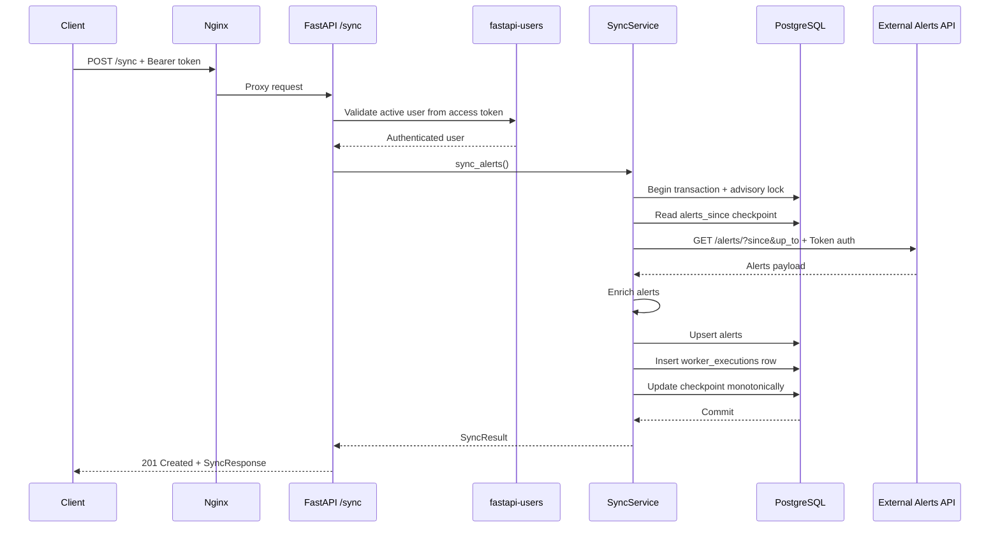
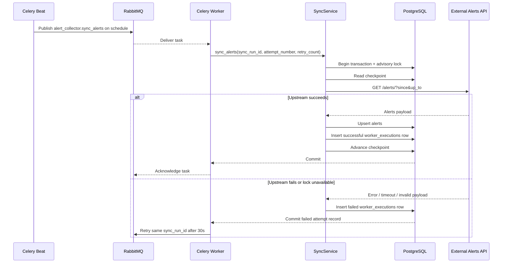
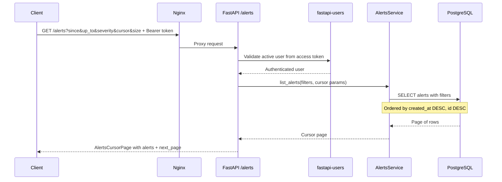
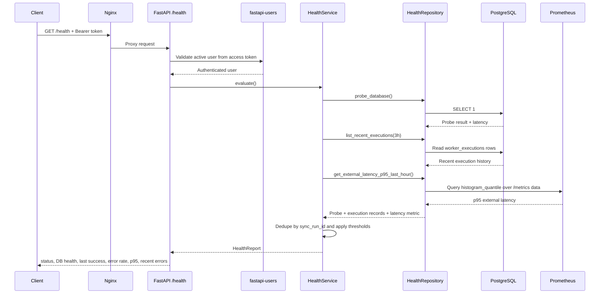

# Alert Collector Architecture

This document maps the current `alert-collector` implementation to the running architecture and describes the main request and execution paths with sequence diagrams. It consolidates the service-level runtime notes from `alert-collector/README.md` and the API exposure/authentication decisions in `docs/DECISIONS.md`.

## Components

- **Nginx edge**: publishes the collector on port `8000` and currently forwards `/auth/*`, `/alerts`, `/sync`, and `/health`.
- **API**: FastAPI app (`api/app.py`) exposing auth routes, `/alerts`, `/sync`, `/health`, `/metrics`, and `/ping`.
- **Auth layer**: `fastapi-users` with database-backed bearer tokens (`auth/*`, `users/*`).
- **Worker**: Celery task runner (`worker/tasks.py`).
- **Beat**: Celery scheduler (`worker/scheduler.py`) enqueueing periodic sync tasks.
- **Broker**: RabbitMQ (`RABBIT_MQ`) used by worker and beat, with a dedicated dead-letter exchange/queue path for failed task delivery.
- **Sync service**: orchestration (`sync/service.py`) with advisory lock (`sync/locking.py`).
- **External service**: upstream mock alerts endpoint consumed by `external_client/client.py`.
- **DB**: PostgreSQL via SQLAlchemy models/session (`db/*`), migrations in Alembic.
- **Health service**: status derivation (`health/service.py`) backed by `health/repository.py`.
- **Prometheus**: scrapes `/metrics` and provides external-call latency history to `/health`.

## Local runtime context

The default local deployment is a Docker Compose stack that boots:

- Nginx edge on `http://localhost:8000`
- FastAPI API container
- Celery worker container
- Celery beat container
- RabbitMQ broker
- PostgreSQL database
- Prometheus
- External mock alert source

The root `task setup` flow provisions local secrets, installs Python dependencies, generates local RabbitMQ TLS material, and starts the full stack.

## Edge exposure and auth model

The current edge and auth behavior is:

- Public edge endpoints: `POST /auth/login`, `POST /auth/logout`, `GET /alerts`, `POST /sync`, `GET /health`
- Internal API-only endpoints (not exposed by Nginx): `GET/PATCH /users/me`, `GET/PATCH/DELETE /users/{id}`, `/metrics`, `/ping`, `/docs`, `/redoc`, `/openapi.json`
- Business endpoints require database-backed bearer-token auth via `fastapi-users` (`Authorization: Bearer <token>`)
- External source auth is independent and uses `Authorization: Token <EXTERNAL_SERVICE_TOKEN>`
- Nginx rate limits `/auth/*` to `5` requests/minute per client IP with burst `3`, returning `429` when exceeded

## `/sync` manual execution



### Notes

- `POST /sync` uses the same sync orchestration as worker-triggered executions.
- The sync window is based on the stored `alerts_since` checkpoint, or a fallback lookback derived from `SYNC_FREQUENCY_MINUTES`.
- Success writes alerts, checkpoint state, and a `worker_executions` record in one transaction.
- External failures are recorded as failed executions and returned as `502`; lock contention becomes `409`.

## Worker and scheduled executions



### Notes

- Beat schedules the task every `SYNC_FREQUENCY_MINUTES` using a crontab expression.
- Worker retries reuse the same `sync_run_id` and increment `attempt_number`.
- Health calculations later dedupe retries by keeping the latest attempt for each `sync_run_id`.

## Messaging topology and DLQ behavior

Celery messaging currently uses two RabbitMQ queues:

- Primary queue: `alert-collector`
- Dead-letter queue: `alert-collector.dlq`

The primary queue is declared with:

- `x-dead-letter-exchange=alert-collector.dlx`
- `x-dead-letter-routing-key=alert-collector.dead`

Dead-lettered messages are routed through `alert-collector.dlx` using routing key `alert-collector.dead` and land in `alert-collector.dlq`. For operational checks, validate queue arguments and queue depth with:

```bash
docker compose exec rabbitmq rabbitmqctl -p /alerts list_queues name arguments messages_ready messages_unacknowledged
docker compose exec rabbitmq rabbitmqctl -p /alerts list_exchanges name type
```

## `/alerts` retrieval



### Notes

- Supported filters are `since`, `up_to`, and `severity`.
- Pagination is cursor-based through `fastapi-pagination`/`sqlakeyset`; page size is `1..200` and defaults to `50`.
- The API returns the page items under the `alerts` field alias.

## `/health` evaluation



### Notes

- Status is derived from DB availability, a successful sync in the last 3 hours, last successful sync freshness, error rate, and p95 external latency from Prometheus.
- Retry attempts are deduped by taking the latest execution for each `sync_run_id`.
- `recent_errors` returns the most recent failed deduped executions.

## Configuration touchpoints

Settings are centralized in `alert-collector/src/alert_collector/settings.py`.

- Infra: `DATABASE_URL`, `RABBIT_MQ`, `RABBIT_MQ_TLS_CA_CERT`
- External ingest: `EXTERNAL_SERVICE_HOST`, `EXTERNAL_SERVICE_TOKEN`
- Scheduler/API: `SYNC_FREQUENCY_MINUTES`, `SERVICE_HOST`
- Optional health tuning: `PROMETHEUS_URL`, `HEALTH_RECENT_SUCCESS_HOURS`, `HEALTH_SUCCESS_STALE_MINUTES`, `HEALTH_ERROR_RATE_WARN`, `HEALTH_ERROR_RATE_DOWN`, `HEALTH_P95_WARN_SECONDS`, `HEALTH_P95_DOWN_SECONDS`
