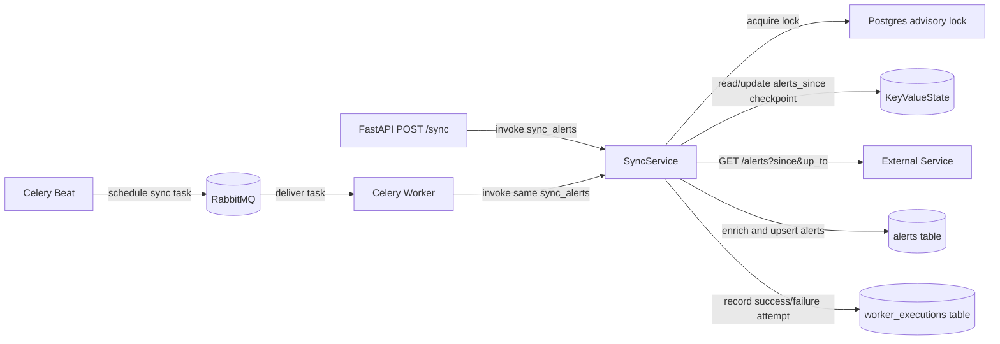
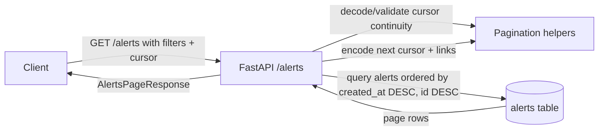
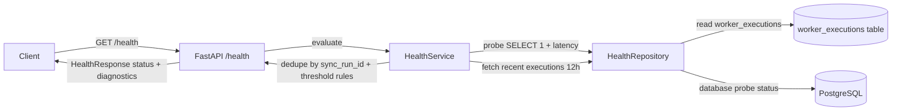

# Alert Collector Architecture

This document maps the current `alert-collector` implementation to the planned architecture and shows component interactions for the three primary use cases: `sync`, `alerts`, and `health`.

## Components

- **API**: FastAPI app (`api/app.py`) exposing `/sync`, `/alerts`, `/health`.
- **Worker**: Celery task runner (`worker/tasks.py`).
- **Beat**: Celery scheduler (`worker/scheduler.py`) enqueueing periodic sync tasks.
- **Broker**: RabbitMQ (`RABBIT_MQ`) used by worker and beat.
- **Sync Service**: orchestration (`sync/service.py`) with advisory lock (`sync/locking.py`).
- **External Service**: upstream alerts endpoint consumed by `external_client/client.py`.
- **DB**: PostgreSQL via SQLAlchemy models/session (`db/*`), migrations in Alembic.
- **Health Service**: status derivation (`health/service.py`) backed by repository (`health/repository.py`).

## Sync use case

### Interaction diagram

### Flow notes

- `POST /sync` and `sync_alerts_task` share the same orchestration path.
- Sync execution is guarded by a transaction-scoped advisory lock.
- Alerts, worker execution record, and checkpoint changes are committed atomically.
- On ingestion failure, a failed execution is stored and checkpoint does not advance.

## Alerts use case

### Interaction diagram

### Flow notes

- Filters are `since`, `up_to`, `severity`; pagination uses `cursor` + `limit`.
- Cursor continuity rejects mismatched filter reuse for stable paging semantics.
- Canonical ordering is descending by `created_at`, then `id`.

## Health use case

### Interaction diagram

### Flow notes

- Health status combines DB availability, success staleness, error-rate, and p95 latency.
- Retry attempts are deduped by taking the latest attempt per `sync_run_id`.
- Output includes DB probe fields, last successful sync, rates/latency, and recent errors.

## Configuration touchpoints

Settings are centralized in `alert-collector/src/alert_collector/settings.py`.

- Infra: `DATABASE_URL`, `RABBIT_MQ`.
- External ingest: `EXTERNAL_SERVICE_HOST`, `EXTERNAL_SERVICE_TOKEN`.
- Scheduler/API: `SYNC_FREQUENCY_MINUTES`, `SERVICE_HOST`.
- Optional behavior tuning: `SYNC_BOOTSTRAP_LOOKBACK_MINUTES` and health threshold env vars.
